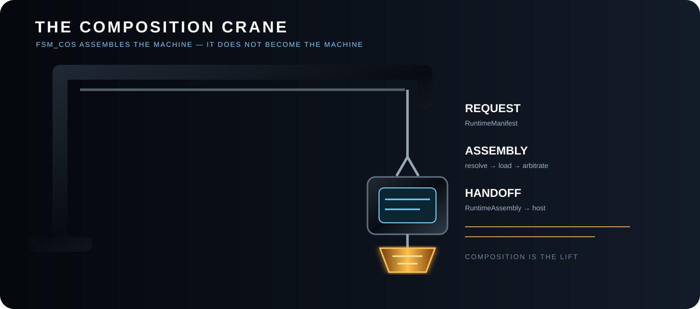
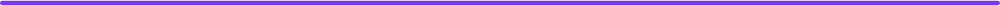

# 00 ⚫ The Singularity Workshop — FSM_COS

[](https://opensource.org/licenses/MIT)
[](https://www.nuget.org/packages/TheSingularityWorkshop.FSM_COS)
[](https://www.nuget.org/packages/TheSingularityWorkshop.FSM_COS)

[](https://github.com/TrentBest/TheSingularityWorkshop.FSM_COS/actions/workflows/package.yml)
[](https://github.com/TrentBest/TheSingularityWorkshop.FSM_COS/commits/master)
[](https://codecov.io/gh/TrentBest/TheSingularityWorkshop.FSM_COS)

## 🔵 01 Definition


**FSM_COS is a platform-neutral computation-composition kernel that resolves MicroBundles and assembles a runtime for handoff to a host.**

## 🟩 02 Visual identity


Git is static. The architecture does not have to *feel* static.

FSM_COS uses static SVG architecture art as the canonical visual language. The crane is a deliberately simple symbol: it represents the composition boundary doing work, not a UI animation.

The rule for repository visuals is simple: **illustrate the concept, not the decoration**. Architecture diagrams should remain readable, versionable, and useful in GitHub, package documentation, and generated documentation.

### Architecture visual map

The documentation diagrams are deliberately architecture-first: they show where responsibility lives, what crosses the FSM_COS boundary, and where composition stops.

- [FSM_COS system overview](docs/assets/fsm-cos-system.svg)
- [Composition boundary](docs/assets/composition-boundary.svg)
- [Composition overview](docs/assets/fsm-cos-overview.svg)
- [Runtime Manifest publication pipeline](docs/assets/runtime-manifest-pipeline.svg)
- [Dependency resolution](docs/assets/dependency-resolution.svg)
- [Arbitration and convergence](docs/assets/arbitration-convergence.svg)
- [Runtime boundary](docs/assets/runtime-boundary.svg)
- [Composition crane](docs/assets/fsm-cos-crane.svg)
- [MicroBundle cartridge](docs/assets/microbundle-cartridge.svg)
- [RuntimeAssembly handoff](docs/assets/runtime-assembly-handoff.svg)

## 🔷 03 Plain-language explanation


> **Engineering identity:** FSM_COS is deliberately a computation platform, not an application platform. It does not know whether the computation will become a WebPage, WebApp, AnyApp, DistributedApp, desktop tool, service, simulation, spreadsheet-like system, or something with no user interface at all.

Its job is to turn a defined computation request into an assembled runtime that another system can execute or manifest. Application-specific execution scheduling remains outside the kernel.

The current project directly references **FSM_API 1.0.13** for state/context primitives and **MicroBundleDomain 1.0.1** for the canonical MicroBundle contract. These are the dependencies declared by the current `development` project file. FSM_COS is deliberately **not an application framework**: no browser, desktop UI, Unity runtime, renderer, database, warehouse, or product type is built into the kernel.

<p align="center">
  
</p>

<p align="center"><em>Runtime request → composition → stable assembly → host manifestation</em></p>

It takes a [Runtime Manifest](docs/RUNTIME_MANIFEST.md), resolves the requested computation, and produces a stable [RuntimeAssembly](docs/RUNTIME_ASSEMBLY.md) for another system to execute or manifest.

~~~text
Runtime Manifest
      │
      ▼
   FSM_COS
      │
      ├── resolve MicroBundles
      ├── resolve dependencies
      ├── propagate configuration
      ├── load/install bundles
      ├── arbitrate toward convergence
      ▼
RuntimeAssembly
~~~

> **FSM_COS assembles the computation. It does not become the application.**

## 🟠 04 Choose your path


- **New to FSM_COS:** start with the definition and responsibility boundary above, then read [FSM_COS Theory](docs/THEORY.md).
- **Integrating a host:** read [Runtime Manifest](docs/RUNTIME_MANIFEST.md), [RuntimeAssembly](docs/RUNTIME_ASSEMBLY.md), and [WebPage Integration](docs/WEBPAGE_INTEGRATION.md) as applicable.
- **Building or changing FSM_COS:** use [Development](docs/DEVELOPMENT.md) and the [Documentation Index](DOCUMENTATION_INDEX.md).
- **Checking ecosystem ownership or package alignment:** use the [Ecosystem Integration Map](docs/ECOSYSTEM_INTEGRATION_MAP.md) and [Dependency Alignment Checklist](docs/DEPENDENCY_ALIGNMENT_CHECKLIST.md).

## 🟣 05 At a glance



**Package:** TheSingularityWorkshop.FSM_COS  
**Source package version:** `0.1.0-alpha.5`  
**Direct package dependencies:** `TheSingularityWorkshop.FSM_API 1.0.13`; `TheSingularityWorkshop.MicroBundleDomain 1.0.1`  
**Target framework:** .NET 8 (`net8.0`)  
**License:** MIT

The package workflow builds, tests, packs, and uploads artifacts. Its NuGet publication job is currently hard-disabled by an explicit `&& false` guard. A source version or successful build is not evidence that a package version was published, and this documentation change does not authorize publication.

## 🟢 06 Responsibility boundary


<p align="center">
  
</p>

FSM_COS is not simply a bundle loader. It is the **composition kernel**: the layer that turns a published runtime request into a stable assembled composition.

The central distinction is:

> **The manifest says what is requested. FSM_COS determines what must exist together. RuntimeAssembly says that composition is ready for handoff. The host decides what happens next.**

The deeper explanation lives in [FSM_COS Theory](docs/THEORY.md). The README uses that theory as a map and links into it repeatedly so the implementation and the architectural model stay connected.

### The computation boundary

```text
computation request
      ↓
Runtime Manifest
      ↓
    FSM_COS
      ├── dependency closure
      ├── optional configuration
      ├── loading
      └── arbitration / convergence
      ↓
RuntimeAssembly
      ↓
execution / manifestation / next system
```

**FSM_COS assembles the system. It does not become the system.**

See [Theory — what “composition of systems” means](docs/THEORY.md#1-what-does-composition-of-systems-mean) and [Runtime Boundary](docs/RUNTIME_BOUNDARY.md).

##  07 Architecture and ecosystem


FSM_COS is the repository for the **common computation-composition boundary** in The Singularity Workshop architecture.

It is deliberately separate from:

- **FSM_API** — behavioral/state-machine primitives.
- **TheSingularityWorkshop.GUI** — semantic GUI construction and platform manifestation.
- **WebPage / WebForge** — a browser host and proving ground.
- **Unity-facing adapters or packages** — platform integration, not the composition kernel.
- **Warehouse infrastructure** — storage and delivery of data.
- **Experiences** — things a user encounters and executes.

FSM_COS answers one deliberately general question:

> **Given a published computation request, what must be assembled before the resulting computation can be handed to another system?**

The repository therefore owns the composition contracts, dependency closure, configured loading, arbitration, convergence, and the resulting RuntimeAssembly.

### Current development boundary

The current `development` line is the active architecture workstream. The project file currently declares `0.1.0-alpha.5`; this source declaration is not a claim that this version has been published to NuGet. The runtime contract and documentation are still being refined:

~~~text
RuntimeManifest
    ↓
MicroBundle identity + version
    ↓
MicroBundle catalog / resolver
    ↓
optional configuration source
    ↓
dependency closure
    ↓
Load()
    ↓
Arbitrate() rounds
    ↓
RuntimeAssembly
~~~

It does **not** own:

- application-specific execution scheduling;
- GUI rendering;
- browser, desktop, or Unity lifecycle;
- Warehouse allocation;
- telemetry or metaDev adaptation;
- networking;
- Experience presentation;
- general application configuration.

Those concerns can become inputs, MicroBundles, or host-side layers without turning FSM_COS into an application framework.

### The design target is deliberately broader than any current host

The same kernel can be used to assemble computation for a WebPage, WebApp, AnyApp, DistributedApp, service, tool, simulation, data processor, spreadsheet-like application, or a system that has no user interface at all.

The application is **not** the abstraction. The computation is.

FSM_COS therefore has no architectural preference for:

- web over desktop;
- desktop over distributed;
- interactive over headless;
- GUI over command line;
- game over business software;
- one runtime platform over another.

Those are manifestations or application choices made outside the kernel.

## 🟢 08 Quick start


This repository's documented artifact is the .NET 8 FSM_COS library. The README is an architectural orientation, not a claim that every integration scenario below is already exercised end-to-end.

1. Install or reference the package version appropriate to your project from [NuGet](https://www.nuget.org/packages/TheSingularityWorkshop.FSM_COS), or build the current source from the repository.
2. Read [Runtime Manifest](docs/RUNTIME_MANIFEST.md) to understand the composition request and [RuntimeAssembly](docs/RUNTIME_ASSEMBLY.md) to understand the handoff.
3. Supply the MicroBundle catalog and any configuration source through the contracts described in [Consuming MicroBundles](docs/CONSUMING_MICROBUNDLES.md).
4. Follow [Development and verification](docs/DEVELOPMENT.md) before relying on a source build or adapting examples.

**Status note:** source version, NuGet publication, and a successful local build are separate facts. Check the package page and current CI rather than assuming they are interchangeable.

## 🟪 09 Core concepts: the Runtime Manifest


<p align="center">
  
</p>

A [RuntimeManifest](docs/RUNTIME_MANIFEST.md) is a **published composition request**, not an application configuration file. The manifest identifies the MicroBundles and their requested versions. Per-MicroBundle configuration is a separate concern and may be absent; absence means the MicroBundle uses its defaults.

Editor/tooling systems may know rich information:

- human-readable names;
- ontology relationships;
- variants;
- dependency relationships;
- provenance;
- visual/editor structure;
- authoring metadata.

That information is authored and validated by the systems that own those domains. FSM_COS consumes the resulting machine-oriented manifest and optional configuration source; it does not define the authoring model.

FSM_COS consumes the published representation.

See [Runtime Manifest Theory](docs/MANIFEST_THEORY.md) and the deeper [FSM_COS Theory](docs/THEORY.md#3-why-the-manifest-exists).

### Consuming MicroBundles

FSM_COS does not define what a MicroBundle means. **MicroBundleDomain owns that domain.**

FSM_COS consumes the domain-owned contract through an application- or repository-supplied catalog.

```text
MicroBundleDomain
      │ defines
      ▼
IMicroBundle
      │ consumed by
      ▼
FSM_COS
      │
      ├── resolve
      ├── load
      ├── arbitrate
      └── hand off
```

A developer is free to supply MicroBundles from memory, a repository, local storage, remote delivery, generated resources, or another source. FSM_COS only requires the composition boundary represented by `IMicroBundleCatalog`.

See [Consuming MicroBundles](docs/CONSUMING_MICROBUNDLES.md) for concrete usage patterns.

### Dependency resolution

The manifest declares roots. Dependencies are discovered from those roots.

For:

~~~text
A
├── B
│   └── C
└── D
~~~

FSM_COS installs:

~~~text
C → B → D → A
~~~

before arbitration begins.

Cycles are composition errors. Missing bundles are composition errors. FSM_COS does not guess around either condition.

### Configuration

Configuration is deliberately **outside the Runtime Manifest**.

~~~text
Manifest
  └── MicroBundle identity + requested version

Configuration source
  ├── MicroBundle A configuration
  ├── MicroBundle B configuration
  └── optional entries
~~~

FSM_COS may receive configuration through an abstraction supplied by the host or repository layer. It does not read files, choose a file format, or interpret domain configuration.

If a MicroBundle has no configuration entry, it is loaded with no external configuration and therefore uses its own defaults.

This keeps three responsibilities distinct:

- **Manifest** — which MicroBundles and versions are requested.
- **Configuration source** — how a particular MicroBundle is configured for this runtime.
- **FSM_COS** — how the resulting composition is resolved, loaded, and arbitrated.

When configuration becomes a **serialized representation**, FSM_COS deliberately points downward to **[TheSingularityWorkshop.FSM_Serialization](https://github.com/TrentBest/TheSingularityWorkshop.FSM_Serialization)** rather than defining another serializer here. See [FSM_COS Theory — Composition is not serialization](docs/THEORY.md#14-composition-is-not-serialization) and the [FSM_Serialization Theory](https://github.com/TrentBest/TheSingularityWorkshop.FSM_Serialization/blob/master/docs/THEORY.md).

### Arbitration

Loading establishes the initial composition.

Arbitration allows the installed set to reconcile itself:

~~~text
load
  ↓
round
  ↓
changed?
  ├── yes → another round
  └── no  → stable RuntimeAssembly
~~~

The current default maximum is **10 rounds**.

A bundle returns true when its participation changed the composition and false when it did not. A complete round with no changes is convergence.

Non-convergence is an error. FSM_COS does not return an assembly that it knows is unstable.

See [Arbitration and Convergence](docs/ARBITRATION.md) and [FSM_COS Theory — Arbitration is composition negotiation](docs/THEORY.md#8-arbitration-is-composition-negotiation).

### RuntimeAssembly is the handoff

[RuntimeAssembly](docs/RUNTIME_ASSEMBLY.md) is the result of composition.

<p align="center">
  
</p>

It records the runtime identity, loaded MicroBundles, and arbitration result. It is not the application and it is not a renderer.

A host receives the assembled result and decides how to execute, present, or encounter it.

~~~text
                  RuntimeAssembly
                         │
          ┌──────────────┼──────────────┐
          ▼              ▼              ▼
       WebForge        AnyApp      another host
          │
        GUI
          │
       browser
~~~

**Composition is not manifestation.**

##  10 Host integration and usage


WebPage is one host and proving ground for FSM_COS; it is not a special case inside the composition kernel. The intended flow is:

~~~text
WebPage published manifest
        ↓
     FsmCos
        ↓
IMicroBundleCatalog supplied by WebPage
        ↓
 RuntimeAssembly
        ↓
WebPage / GUI manifestation
        ↓
     Blazor/browser
~~~

WebPage should reference the TheSingularityWorkshop.FSM_COS package and implement the catalog/host boundary around it. Platform-specific lifecycle, browser APIs, GUI rendering, and Experience presentation remain outside FSM_COS.

The first AI/GUI vertical slice now follows the same boundary: WebPage supplies ProtocolAI, GrammarAI, and GUI-facing MicroBundles through its catalog; FSM_COS composes them and returns them through RuntimeAssembly; the WebPage host uses the shared GUI builder for manifestation and owns clipboard/provider interaction. This keeps the package reusable while proving that the semantic exchange can be assembled as ordinary runtime capability.

For the concrete integration contract, see [WebPage Integration](docs/WEBPAGE_INTEGRATION.md) and [FSM_COS Theory — Same composition, different manifestation](docs/THEORY.md#10-same-computation-different-manifestation).

### Responsibility invariant

~~~text
FSM_API      → behavior/state primitives
FSM_COS      → computation composition + stable assembly
MicroBundle  → focused domain capability/content/behavior
Repository   → artifact discovery and delivery
Serialization→ representation
Host         → execution / manifestation
Application  → whatever the assembled computation is used to build
~~~

The boundaries can evolve. The responsibility of FSM_COS should remain clear:

> **Assemble the requested computation. Return a stable composition. Hand it to whatever executes or manifests it.**

---

##  11 Verification and development


Use the [Development guide](docs/DEVELOPMENT.md) for repository-specific build, test, and contribution instructions. Use the [current GitHub Actions runs](https://github.com/TrentBest/TheSingularityWorkshop.FSM_COS/actions) and [coverage report](https://codecov.io/gh/TrentBest/TheSingularityWorkshop.FSM_COS) as live evidence; badges alone do not establish that a particular commit passed.

### Repository structure

~~~text
TheSingularityWorkshop.FSM_COS/
│
├── README.md
├── LICENSE.txt
├── TheSingularityWorkshop.FSM_COS.sln
├── TheSingularityWorkshop.FSM_COS.slnx
│
├── docs/
│   ├── THEORY.md
│   ├── ARCHITECTURE.md
│   ├── RUNTIME_MANIFEST.md
│   ├── CONSUMING_MICROBUNDLES.md
│   ├── RUNTIME_ASSEMBLY.md
│   ├── MANIFEST_THEORY.md
│   ├── ARBITRATION.md
│   ├── RUNTIME_BOUNDARY.md
│   └── DEVELOPMENT.md
│
├── src/
│   └── FSM_COS/
│       ├── FSM_COS.csproj
│       ├── IFsmCos.cs
│       ├── FsmCos.cs
│       ├── RuntimeManifest.cs
│       ├── IMicroBundleCatalog.cs
│       ├── MicroBundleLoadContext.cs
│       ├── ArbitrationContext.cs
│       └── RuntimeAssembly.cs
│
└── tests/
    └── FSM_COS.Tests/
        └── FsmCosTests.cs
~~~

There is intentionally **one canonical FSM_COS implementation project**: src/FSM_COS/FSM_COS.csproj.

The old root scaffold that contained only Class1.cs has been removed. The solution now points at the real project.

<p align="center">
  
</p>

<p align="center"><strong>AI capabilities are composed like any other capability; FSM_COS does not become the AI framework.</strong></p>

## 🟣 12 Documentation map / further reading


This repository follows the shared [Documentation Standard](DOCUMENTATION_STANDARD.md). Use the [Documentation Index](DOCUMENTATION_INDEX.md) to choose a reading path by goal; the README is the entry point, while focused documents remain authoritative for theory, architecture, and individual contracts.

This repository carries its own architecture and theory. The documents here describe **FSM_COS itself**, rather than asking another repository to explain its internals.

- [Theory](docs/THEORY.md) — why the composition boundary exists.
- [Architecture](docs/ARCHITECTURE.md) — contracts and runtime flow.
- [Runtime Manifest](docs/RUNTIME_MANIFEST.md) — the published request itself, with examples and the alpha contract.
- [Consuming MicroBundles](docs/CONSUMING_MICROBUNDLES.md) — the composable unit contract.
- [RuntimeAssembly](docs/RUNTIME_ASSEMBLY.md) — the stable handoff object.
- [Runtime Manifest Theory](docs/MANIFEST_THEORY.md) — the deeper theory behind publication.
- [Arbitration and Convergence](docs/ARBITRATION.md) — reconciliation semantics.
- [Runtime Boundary](docs/RUNTIME_BOUNDARY.md) — what belongs here versus in hosts and neighboring systems.
- [Development](docs/DEVELOPMENT.md) — how to evolve and verify the repository.
- [WebPage Integration](docs/WEBPAGE_INTEGRATION.md) — how the browser host consumes FSM_COS without pulling platform concerns into the kernel.

##  13 Related projects, resources & Workshop support


### 📦 Get the core packages

- **FSM_API:** [Core NuGet](https://www.nuget.org/packages/TheSingularityWorkshop.FSM_API) · [Source](https://github.com/TrentBest/FSM_API)
- **FSM_COS:** [NuGet](https://www.nuget.org/packages/TheSingularityWorkshop.FSM_COS) · [Source](https://github.com/TrentBest/TheSingularityWorkshop.FSM_COS)
- **FSM_Serialization:** [NuGet](https://www.nuget.org/packages/TheSingularityWorkshop.FSM_Serialization) · [Source](https://github.com/TrentBest/TheSingularityWorkshop.FSM_Serialization)

### 💖 Support The Singularity Workshop

- **Patreon:** [Support us on Patreon](https://www.patreon.com/c/TheSingularityWorkshop)
- **PayPal:** [Make a donation](https://www.paypal.com/donate/?hosted_button_id=3Z7263LCQMV9J)

<p align="center">
  <a href="https://github.com/TrentBest/FSM_API">
    
  </a>
</p>

<p align="center">
  <em>The Singularity Workshop — Tools for the curious, the bold, and the systemically inclined.</em><br>
  <strong>Because state shouldn't be a mess.</strong>
</p>
