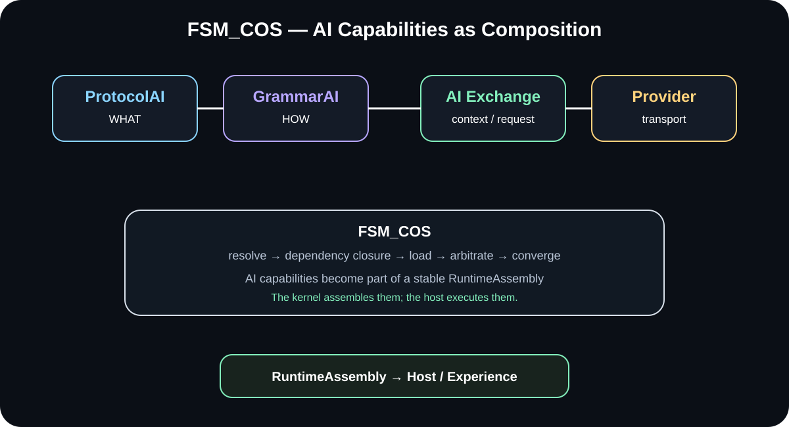

# ✳️ 00 The Singularity Workshop — FSM_COS

[](https://opensource.org/licenses/MIT)
[](https://www.nuget.org/packages/TheSingularityWorkshop.FSM_COS)
[](https://www.nuget.org/packages/TheSingularityWorkshop.FSM_COS)

[](https://github.com/TrentBest/TheSingularityWorkshop.FSM_COS/actions/workflows/package.yml)
[](https://github.com/TrentBest/TheSingularityWorkshop.FSM_COS/commits/master)
[](https://codecov.io/gh/TrentBest/TheSingularityWorkshop.FSM_COS)

<p align="center">
  
</p>

## 🟦 01 The problem—and our response

Software creators want to build useful experiences without being forced to rebuild every capability for every host. Yet reusable ideas often become entangled with the application, engine, UI, or runtime that first contains them. Moving a capability elsewhere can mean carrying an entire framework, duplicating behavior, or redesigning the integration.

**FSM_COS addresses one part of that problem:** it composes a requested set of independent MicroBundles, resolves their dependencies, applies available configuration, arbitrates toward a stable result, and returns a `RuntimeAssembly` to the host. It does not become the application, game engine, or renderer.

The larger Workshop goal is to make capabilities and experiences easier to compose and consume across hosts. The kernel is one boundary in that architecture—not, by itself, proof that every kind of experience is already portable or more efficient than a particular engine.

## 🟣 02 How Workshop documentation is organized

The Workshop is a family of repositories with distinct responsibilities. Each repository should explain the domain it owns, state its boundaries, and link to neighboring projects rather than copy their manuals.

- **This README** is the front door: problem, response, mental model, a first proof, and a map to deeper reading.
- **Focused guides** explain how to use a contract or perform a task.
- **Theory and architecture documents** explain why the abstractions exist, how responsibilities are divided, and what must remain true.
- **API, verification, and development documents** provide exact contracts and reproducible engineering detail.
- **Neighboring repositories** remain authoritative for their own domains; this README describes how FSM_COS consumes them.

See the shared [Workshop Documentation Standard](DOCUMENTATION_STANDARD.md) for the visual and editorial rules, and the [Documentation Index](DOCUMENTATION_INDEX.md) for reader paths through this repository. This README uses the same principles while putting the problem and response before the deeper architecture tour.

## 🟦 03 The problem in depth—and how FSM_COS addresses it

A host should not have to own every capability it uses. A browser application, desktop application, simulation, service, or other consumer may need a composition of independent behaviors. If the host also owns the definition and dependency logic for every capability, reuse becomes tied to that particular host.

FSM_COS separates **the request, the composition, and the host**:

- A **Runtime Manifest** states which MicroBundles and versions are requested.
- **MicroBundleDomain** owns the MicroBundle contract; a catalog supplied by the consumer resolves the requested identities.
- **FSM_COS** resolves dependency closure, supplies optional configuration, loads the bundles, and arbitrates until the composition stabilizes or fails explicitly.
- A **RuntimeAssembly** carries the composed result to the host.
- The **host** decides how that result is executed, presented, or used.

```text
Runtime Manifest
      │ says what is requested
      ▼
   FSM_COS
      ├── resolve requested MicroBundles
      ├── resolve dependencies
      ├── apply available configuration
      ├── load the composition
      └── arbitrate toward convergence
      ▼
RuntimeAssembly
      │ handoff, not an application
      ▼
Host / experience / manifestation
```

The distinction matters: **FSM_COS assembles the computation; it does not become the application.** That lets the composition kernel stay platform-neutral. It also means we must be precise about what it does *not* provide: it does not automatically render a GUI, schedule every application loop, or make an experience portable without compatible bundles and a capable host.

The current project references **FSM_API 1.0.13** for state/context primitives and **MicroBundleDomain 1.0.1** for the canonical MicroBundle contract, as declared by the current `development` project. The architectural aim is broader than any one host, but claims about performance or cross-host behavior must be demonstrated by relevant measurements and working integrations—not inferred from the diagram alone.

## 🟢 04 See it in a minute

You do not need to understand the whole architecture to see the central behavior.

A test MicroBundle with ID `1` declares a dependency on MicroBundle `2`. The manifest requests only bundle `1`. FSM_COS resolves and loads the dependency first, so the resulting assembly is ordered `2 → 1`.

```csharp
var catalog = new TestCatalog(
    new TestBundle(2),
    new TestBundle(1, MicroBundleDependencyRequest.Unconfigured(2)));

var assembly = new FsmCos(catalog).Execute(
    new RuntimeManifest(42, new[] { Entry(1) }));

Assert.Equal(new ulong[] { 2, 1 }, assembly.Bundles.Select(x => x.Id));
```

This is a **test-fixture excerpt**, not a copy-paste application: `TestCatalog`, `TestBundle`, and `Entry` are helpers defined in the test project. The assertion is taken from the repository's `Execute_loads_dependencies_before_requesting_bundle` test.

To run that proof from a clone:

```bash
dotnet test tests/FSM_COS.Tests/FSM_COS.Tests.csproj --filter "FullyQualifiedName~Execute_loads_dependencies_before_requesting_bundle"
```

The expected result is a passing test confirming that the requested root brings its dependency into the assembly first. For the consumer-owned catalog and bundle contracts needed to build your own composition, continue to [Consuming MicroBundles](docs/CONSUMING_MICROBUNDLES.md). For the complete conceptual model, continue to [FSM_COS Theory](docs/THEORY.md).

## 🟪 05 Documentation and theory

This is the starting map. Open the document that answers your next question; the README stays focused on orientation while each guide remains responsible for its own detail.

- [Theory](docs/THEORY.md) — why the composition boundary exists and which ideas shape it.
- [Architecture](docs/ARCHITECTURE.md) — contracts, responsibility ownership, and runtime flow.
- [Runtime Manifest](docs/RUNTIME_MANIFEST.md) — what the composition request identifies.
- [Consuming MicroBundles](docs/CONSUMING_MICROBUNDLES.md) — the bundle and catalog contracts used by a consumer.
- [RuntimeAssembly](docs/RUNTIME_ASSEMBLY.md) — what is handed to the host after composition.
- [Runtime Manifest Theory](docs/MANIFEST_THEORY.md) — the rationale behind the published request.
- [Arbitration and Convergence](docs/ARBITRATION.md) — how reconciliation works and how stability is determined.
- [Runtime Boundary](docs/RUNTIME_BOUNDARY.md) — what belongs in FSM_COS versus a host or neighboring system.
- [Development](docs/DEVELOPMENT.md) — how to build, test, and change the repository.
- [WebPage Integration](docs/WEBPAGE_INTEGRATION.md) — how the browser host consumes FSM_COS without moving browser concerns into the kernel.
- [Documentation Index](DOCUMENTATION_INDEX.md) — a reader-oriented map of the wider document set.
- [Ecosystem Integration Map](docs/ECOSYSTEM_INTEGRATION_MAP.md) — how packages, MicroBundles, FSM_COS, and hosts relate, including what is verified versus still a target.

## How this NuGet package fits into the Workshop ecosystem

FSM_COS is designed to be useful as a **reusable composition boundary**, not as a toll gate that forces every creator to adopt the entire Workshop. You can use the package, build your own compatible pieces, or combine the two. The more of the Workshop's contracts and conventions you choose to use, the more naturally your work can fit alongside its other parts—but that alignment is an invitation, not a lock-in requirement.

That is the confidence behind the architecture: **we want other creators to stand on these shoulders.** Reusable capabilities should be useful beyond the repository that introduced them. They should be maintainable as focused parts, discoverable through clear contracts, and composable into experiences their original authors did not anticipate. Over time, we want that compatibility to make it more attractive to create for the Workshop ecosystem—including the possibility of broader discovery, distribution, and monetization as those mechanisms are built.

### The intended relationship

- **NuGet packages** provide reusable code and stable contracts for developers and build-time integration.
- **MicroBundles** are candidates for independently composed runtime capabilities when their contracts and lifecycle support that role.
- **FSM_COS** resolves a runtime request and composes the selected capabilities into a `RuntimeAssembly`.
- **Hosts** such as WebPage, AnyApp, or a creator's own application decide how to present, execute, or otherwise use the result.
- **Creators** remain free to use only the parts that help them, write their own alternatives, and adapt at the boundaries where their design differs.

This is not a claim that every Workshop package is already a MicroBundle, that every bundle works in every host, or that AnyApp can currently host every compatible experience without adaptation. **AnyApp and broader cross-host composition are architectural directions to validate with real integrations.** Compatibility still depends on the contracts, dependencies, platform assumptions, and host capabilities of the particular component.

### How to choose what to use

| If you are... | A useful starting point |
|---|---|
| Using FSM_COS in an existing application | Reference the NuGet package, create or select a catalog, submit a Runtime Manifest, and consume the returned RuntimeAssembly. |
| Building reusable Workshop-compatible capabilities | Start with the MicroBundleDomain contract and the [Consuming MicroBundles guide](docs/CONSUMING_MICROBUNDLES.md); keep domain behavior independent of a specific host where practical. |
| Building a host or experience | Own presentation and application lifecycle in the host; use FSM_COS for composition rather than making the host a dependency of lower-level packages. |
| Using only one useful Workshop library | Use that library on its own when its dependencies and license permit; adopting the whole ecosystem is not a prerequisite. |
| Creating your own equivalent technology | Keep your own contracts if that serves you better. Where you choose compatible Workshop contracts, integration may become easier without requiring you to surrender control of your design. |

For the verified dependency picture, current gaps, and package-versus-MicroBundle decisions, see the [Ecosystem Integration Map](docs/ECOSYSTEM_INTEGRATION_MAP.md). It deliberately distinguishes current repository facts from proposed architecture so that confidence does not turn into an unsupported compatibility promise.

## Additional technical reference

## Choose your path
- **New to FSM_COS:** start with the definition and responsibility boundary above, then read [FSM_COS Theory](docs/THEORY.md).
- **Integrating a host:** read [Runtime Manifest](docs/RUNTIME_MANIFEST.md), [RuntimeAssembly](docs/RUNTIME_ASSEMBLY.md), and [WebPage Integration](docs/WEBPAGE_INTEGRATION.md) as applicable.
- **Building or changing FSM_COS:** use [Development](docs/DEVELOPMENT.md) and the [Documentation Index](DOCUMENTATION_INDEX.md).
- **Checking ecosystem ownership and package boundaries:** use the [Ecosystem Integration Map](docs/ECOSYSTEM_INTEGRATION_MAP.md).

## Package at a glance
**Package:** TheSingularityWorkshop.FSM_COS  
**Source package version:** `0.1.0-alpha.6` (candidate; not yet published)  
**Direct package dependencies:** `TheSingularityWorkshop.FSM_API 1.0.13`; `TheSingularityWorkshop.MicroBundleDomain 1.0.1`; `TheSingularityWorkshop.FSM_UserIO 0.1.0-alpha.1` (for the optional `SemanticIntent` pass-through in `RuntimeManifest` / `RuntimeAssembly`)  
**Target framework:** .NET 8 (`net8.0`)  
**License:** MIT

The package workflow builds, tests, packs, and uploads artifacts, including a separate restore/build/test/pack check against public NuGet dependencies. Its NuGet publication job remains hard-disabled by an explicit `&& false` guard. The alpha.6 candidate has passed package CI and WebPage's source-candidate integration checks, but it is **not yet published**. A source version or successful build is not evidence that a package version was published, and this documentation change does not authorize publication.

## Responsibility boundary

<p align="center">
  
</p>

FSM_COS is not simply a bundle loader. It is the **composition kernel**: the layer that turns a published runtime request into a stable assembled composition.

The central distinction is:

> **The manifest says what is requested. FSM_COS determines what must exist together. RuntimeAssembly says that composition is ready for handoff. The host decides what happens next.**

The deeper explanation lives in [FSM_COS Theory](docs/THEORY.md). The README uses that theory as a map and links into it repeatedly so the implementation and the architectural model stay connected.

### The computation boundary

```text
computation request
      ↓
Runtime Manifest
      ↓
    FSM_COS
      ├── dependency closure
      ├── optional configuration
      ├── loading
      └── arbitration / convergence
      ↓
RuntimeAssembly
      ↓
execution / manifestation / next system
```

**FSM_COS assembles the system. It does not become the system.**

See [Theory — what “composition of systems” means](docs/THEORY.md#1-what-does-composition-of-systems-mean) and [Runtime Boundary](docs/RUNTIME_BOUNDARY.md).

## Architecture and ecosystem

FSM_COS is the repository for the **common computation-composition boundary** in The Singularity Workshop architecture.

It is deliberately separate from:

- **FSM_API** — behavioral/state-machine primitives.
- **TheSingularityWorkshop.GUI** — semantic GUI construction and platform manifestation.
- **WebPage / WebForge** — a browser host and proving ground.
- **Unity-facing adapters or packages** — platform integration, not the composition kernel.
- **Warehouse infrastructure** — storage and delivery of data.
- **Experiences** — things a user encounters and executes.

FSM_COS answers one deliberately general question:

> **Given a published computation request, what must be assembled before the resulting computation can be handed to another system?**

The repository therefore owns the composition contracts, dependency closure, configured loading, arbitration, convergence, and the resulting RuntimeAssembly.

### Current development boundary

The current `development` line is the active architecture workstream. The project file currently declares `0.1.0-alpha.5`; this source declaration is not a claim that this version has been published to NuGet. The runtime contract and documentation are still being refined:

~~~text
RuntimeManifest
    ↓
MicroBundle identity + version
    ↓
MicroBundle catalog / resolver
    ↓
optional configuration source
    ↓
dependency closure
    ↓
Load()
    ↓
Arbitrate() rounds
    ↓
RuntimeAssembly
~~~

It does **not** own:

- application-specific execution scheduling;
- GUI rendering;
- browser, desktop, or Unity lifecycle;
- Warehouse allocation;
- telemetry or metaDev adaptation;
- networking;
- Experience presentation;
- general application configuration.

Those concerns can become inputs, MicroBundles, or host-side layers without turning FSM_COS into an application framework.

### The design target is deliberately broader than any current host

The same kernel can be used to assemble computation for a WebPage, WebApp, AnyApp, DistributedApp, service, tool, simulation, data processor, spreadsheet-like application, or a system that has no user interface at all.

The application is **not** the abstraction. The computation is.

FSM_COS therefore has no architectural preference for:

- web over desktop;
- desktop over distributed;
- interactive over headless;
- GUI over command line;
- game over business software;
- one runtime platform over another.

Those are manifestations or application choices made outside the kernel.

## Core concepts: the Runtime Manifest

<p align="center">
  
</p>

A [RuntimeManifest](docs/RUNTIME_MANIFEST.md) is a **published composition request**, not an application configuration file. The manifest identifies the MicroBundles and their requested versions. Per-MicroBundle configuration is a separate concern and may be absent; absence means the MicroBundle uses its defaults.

Editor/tooling systems may know rich information:

- human-readable names;
- ontology relationships;
- variants;
- dependency relationships;
- provenance;
- visual/editor structure;
- authoring metadata.

That information is authored and validated by the systems that own those domains. FSM_COS consumes the resulting machine-oriented manifest and optional configuration source; it does not define the authoring model.

FSM_COS consumes the published representation.

See [Runtime Manifest Theory](docs/MANIFEST_THEORY.md) and the deeper [FSM_COS Theory](docs/THEORY.md#3-why-the-manifest-exists).

### Consuming MicroBundles

FSM_COS does not define what a MicroBundle means. **MicroBundleDomain owns that domain.**

FSM_COS consumes the domain-owned contract through an application- or repository-supplied catalog.

```text
MicroBundleDomain
      │ defines
      ▼
IMicroBundle
      │ consumed by
      ▼
FSM_COS
      │
      ├── resolve
      ├── load
      ├── arbitrate
      └── hand off
```

A developer is free to supply MicroBundles from memory, a repository, local storage, remote delivery, generated resources, or another source. FSM_COS only requires the composition boundary represented by `IMicroBundleCatalog`.

See [Consuming MicroBundles](docs/CONSUMING_MICROBUNDLES.md) for concrete usage patterns.

### Dependency resolution

The manifest declares roots. Dependencies are discovered from those roots.

For:

~~~text
A
├── B
│   └── C
└── D
~~~

FSM_COS installs:

~~~text
C → B → D → A
~~~

before arbitration begins.

Cycles are composition errors. Missing bundles are composition errors. FSM_COS does not guess around either condition.

### Configuration

Configuration is deliberately **outside the Runtime Manifest**.

~~~text
Manifest
  └── MicroBundle identity + requested version

Configuration source
  ├── MicroBundle A configuration
  ├── MicroBundle B configuration
  └── optional entries
~~~

FSM_COS may receive configuration through an abstraction supplied by the host or repository layer. It does not read files, choose a file format, or interpret domain configuration.

If a MicroBundle has no configuration entry, it is loaded with no external configuration and therefore uses its own defaults.

This keeps three responsibilities distinct:

- **Manifest** — which MicroBundles and versions are requested.
- **Configuration source** — how a particular MicroBundle is configured for this runtime.
- **FSM_COS** — how the resulting composition is resolved, loaded, and arbitrated.

When configuration becomes a **serialized representation**, FSM_COS deliberately points downward to **[TheSingularityWorkshop.FSM_Serialization](https://github.com/TrentBest/TheSingularityWorkshop.FSM_Serialization)** rather than defining another serializer here. See [FSM_COS Theory — Composition is not serialization](docs/THEORY.md#14-composition-is-not-serialization) and the [FSM_Serialization Theory](https://github.com/TrentBest/TheSingularityWorkshop.FSM_Serialization/blob/master/docs/THEORY.md).

### Arbitration

Loading establishes the initial composition.

Arbitration allows the installed set to reconcile itself:

~~~text
load
  ↓
round
  ↓
changed?
  ├── yes → another round
  └── no  → stable RuntimeAssembly
~~~

The current default maximum is **10 rounds**.

A bundle returns true when its participation changed the composition and false when it did not. A complete round with no changes is convergence.

Non-convergence is an error. FSM_COS does not return an assembly that it knows is unstable.

See [Arbitration and Convergence](docs/ARBITRATION.md) and [FSM_COS Theory — Arbitration is composition negotiation](docs/THEORY.md#8-arbitration-is-composition-negotiation).

### RuntimeAssembly is the handoff

[RuntimeAssembly](docs/RUNTIME_ASSEMBLY.md) is the result of composition.

<p align="center">
  
</p>

It records the runtime identity, loaded MicroBundles, arbitration result, and optional semantic intent supplied by the manifest. It is not the application and it is not a renderer.

A host receives the assembled result and decides how to execute, present, or encounter it.

~~~text
                  RuntimeAssembly
                         │
          ┌──────────────┼──────────────┐
          ▼              ▼              ▼
       WebForge        AnyApp      another host
          │
        GUI
          │
       browser
~~~

**Composition is not manifestation.**

## Host integration and usage

WebPage is one host and proving ground for FSM_COS; it is not a special case inside the composition kernel. The intended flow is:

~~~text
WebPage published manifest
        ↓
     FsmCos
        ↓
IMicroBundleCatalog supplied by WebPage
        ↓
 RuntimeAssembly
        ↓
WebPage / GUI manifestation
        ↓
     Blazor/browser
~~~

WebPage should reference the TheSingularityWorkshop.FSM_COS package and implement the catalog/host boundary around it. Platform-specific lifecycle, browser APIs, GUI rendering, and Experience presentation remain outside FSM_COS.

The first AI/GUI vertical slice now follows the same boundary: WebPage supplies ProtocolAI, GrammarAI, and GUI-facing MicroBundles through its catalog; FSM_COS composes them and returns them through RuntimeAssembly; the WebPage host uses the shared GUI builder for manifestation and owns clipboard/provider interaction. This keeps the package reusable while proving that the semantic exchange can be assembled as ordinary runtime capability.

For the concrete integration contract, see [WebPage Integration](docs/WEBPAGE_INTEGRATION.md) and [FSM_COS Theory — Same composition, different manifestation](docs/THEORY.md#10-same-computation-different-manifestation).

### Responsibility invariant

~~~text
FSM_API      → behavior/state primitives
FSM_COS      → computation composition + stable assembly
MicroBundle  → focused domain capability/content/behavior
Repository   → artifact discovery and delivery
Serialization→ representation
Host         → execution / manifestation
Application  → whatever the assembled computation is used to build
~~~

The boundaries can evolve. The responsibility of FSM_COS should remain clear:

> **Assemble the requested computation. Return a stable composition. Hand it to whatever executes or manifests it.**

---

## Verification and development

Use the [Development guide](docs/DEVELOPMENT.md) for repository-specific build, test, and contribution instructions. Use the [current GitHub Actions runs](https://github.com/TrentBest/TheSingularityWorkshop.FSM_COS/actions) and [coverage report](https://codecov.io/gh/TrentBest/TheSingularityWorkshop.FSM_COS) as live evidence; badges alone do not establish that a particular commit passed.

### Repository structure

~~~text
TheSingularityWorkshop.FSM_COS/
│
├── README.md
├── LICENSE.txt
├── TheSingularityWorkshop.FSM_COS.sln
├── TheSingularityWorkshop.FSM_COS.slnx
│
├── docs/
│   ├── THEORY.md
│   ├── ARCHITECTURE.md
│   ├── RUNTIME_MANIFEST.md
│   ├── CONSUMING_MICROBUNDLES.md
│   ├── RUNTIME_ASSEMBLY.md
│   ├── MANIFEST_THEORY.md
│   ├── ARBITRATION.md
│   ├── RUNTIME_BOUNDARY.md
│   └── DEVELOPMENT.md
│
├── src/
│   └── FSM_COS/
│       ├── FSM_COS.csproj
│       ├── IFsmCos.cs
│       ├── FsmCos.cs
│       ├── RuntimeManifest.cs
│       ├── IMicroBundleCatalog.cs
│       ├── MicroBundleLoadContext.cs
│       ├── ArbitrationContext.cs
│       └── RuntimeAssembly.cs
│
└── tests/
    └── FSM_COS.Tests/
        └── FsmCosTests.cs
~~~

There is intentionally **one canonical FSM_COS implementation project**: src/FSM_COS/FSM_COS.csproj.

The old root scaffold that contained only Class1.cs has been removed. The solution now points at the real project.

<p align="center">
  
</p>

<p align="center"><strong>AI capabilities are composed like any other capability; FSM_COS does not become the AI framework.</strong></p>
## 🟨 Related projects, resources & Workshop support


### 📦 Get the core packages

- **FSM_API:** [Core NuGet](https://www.nuget.org/packages/TheSingularityWorkshop.FSM_API) · [Source](https://github.com/TrentBest/FSM_API)
- **FSM_COS:** [NuGet](https://www.nuget.org/packages/TheSingularityWorkshop.FSM_COS) · [Source](https://github.com/TrentBest/TheSingularityWorkshop.FSM_COS)
- **FSM_Serialization:** [NuGet](https://www.nuget.org/packages/TheSingularityWorkshop.FSM_Serialization) · [Source](https://github.com/TrentBest/TheSingularityWorkshop.FSM_Serialization)

### 💖 Support The Singularity Workshop

- **Patreon:** [Support us on Patreon](https://www.patreon.com/c/TheSingularityWorkshop)
- **PayPal:** [Make a donation](https://www.paypal.com/donate/?hosted_button_id=3Z7263LCQMV9J)

<p align="center">
  <a href="https://github.com/TrentBest/FSM_API">
    
  </a>
</p>

<p align="center">
  <em>The Singularity Workshop — Tools for the curious, the bold, and the systemically inclined.</em><br>
  <strong>Because state shouldn't be a mess.</strong>
</p>
