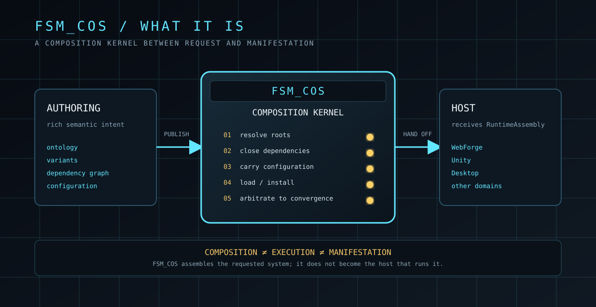
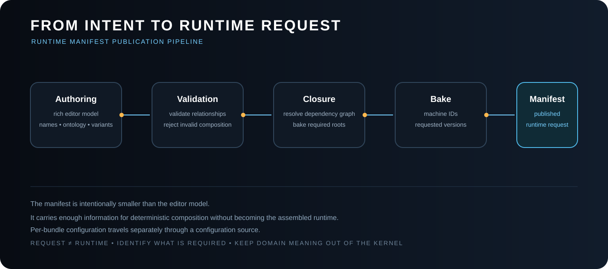
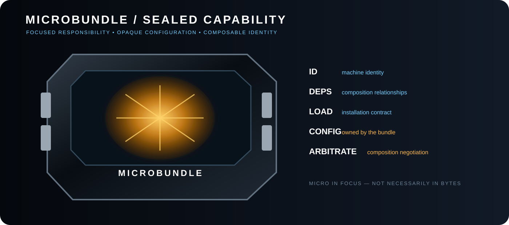
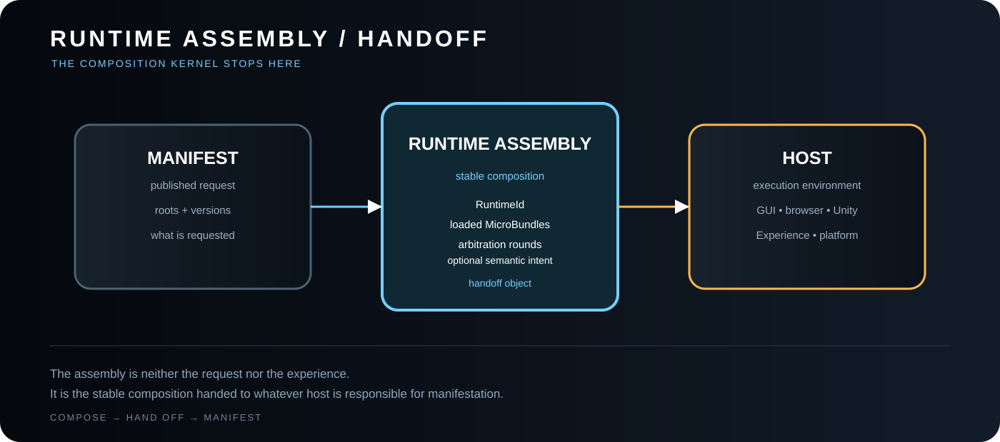

# The Singularity Workshop — FSM_COS

[](https://opensource.org/licenses/MIT)
[](https://www.nuget.org/packages/TheSingularityWorkshop.FSM_COS)
[](https://www.nuget.org/packages/TheSingularityWorkshop.FSM_COS)

[](https://github.com/TrentBest/TheSingularityWorkshop.FSM_COS/actions/workflows/package.yml)
[](https://github.com/TrentBest/TheSingularityWorkshop.FSM_COS/commits/master)
[](https://codecov.io/gh/TrentBest/TheSingularityWorkshop.FSM_COS)

**FSM_COS is the composition system.**

<p align="center">
  
</p>

<p align="center"><em>Runtime request → composition → stable assembly → host manifestation</em></p>

It takes a [Runtime Manifest](docs/RUNTIME_MANIFEST.md) and assembles the [MicroBundles](docs/MICROBUNDLES.md), dependencies, configuration, and runtime components required by that manifest.

~~~text
Runtime Manifest
      │
      ▼
   FSM_COS
      │
      ├── resolve MicroBundles
      ├── resolve dependencies
      ├── propagate configuration
      ├── load/install bundles
      ├── arbitrate toward convergence
      ▼
RuntimeAssembly
~~~

> **FSM_COS is the crane that assembles the machine. It does not become the machine.**

## What FSM_COS actually is

<p align="center">
  
</p>

FSM_COS is not simply a bundle loader. It is the **composition kernel**: the layer that turns a published runtime request into a stable assembled composition.

The central distinction is:

> **The manifest says what is requested. FSM_COS determines what must exist together. RuntimeAssembly says that composition is ready for handoff. The host decides what happens next.**

The deeper explanation lives in [FSM_COS Theory](docs/THEORY.md). The README uses that theory as a map and links into it repeatedly so the implementation and the architectural model stay connected.

### The composition boundary

```text
authoring intent
      ↓
Runtime Manifest
      ↓
    FSM_COS
      ├── dependency closure
      ├── configuration propagation
      ├── configured loading
      └── arbitration / convergence
      ↓
RuntimeAssembly
      ↓
host / manifestation
```

**FSM_COS assembles the system. It does not become the system.**

See [Theory — what “composition of systems” means](docs/THEORY.md#1-what-does-composition-of-systems-mean) and [Runtime Boundary](docs/RUNTIME_BOUNDARY.md).

## Why this repository exists

FSM_COS is the repository for the **composition-of-systems boundary** in The Singularity Workshop architecture.

It is deliberately separate from:

- **FSM_API** — behavioral/state-machine primitives.
- **TheSingularityWorkshop.GUI** — semantic GUI construction and platform manifestation.
- **WebPage / WebForge** — a browser host and proving ground.
- **Unity-facing adapters or packages** — platform integration, not the composition kernel.
- **Warehouse infrastructure** — storage and delivery of data.
- **Experiences** — things a user encounters and executes.

FSM_COS answers one narrower question:

> **Given a published runtime manifest, what must be assembled before that runtime can be handed to a host?**

The repository therefore owns the composition contracts, dependency closure, configured loading, arbitration, convergence, and the resulting RuntimeAssembly.

## Current alpha boundary

The current 0.1.0-alpha.1 implementation is intentionally a small vertical slice:

~~~text
RuntimeManifest
    ↓
BundleRequest
    ↓
MicroBundleCatalog
    ↓
dependency closure
    ↓
configured Load()
    ↓
Arbitrate() rounds
    ↓
RuntimeAssembly
~~~

It does **not** yet own:

- host execution scheduling;
- GUI rendering;
- browser, desktop, or Unity lifecycle;
- Warehouse allocation;
- telemetry or metaDev adaptation;
- networking;
- Experience presentation;
- general application configuration.

Those concerns can become inputs, providers, or later composition layers without turning FSM_COS into an application framework.

## Living architecture

Git is static. The architecture does not have to *feel* static.

The documentation deliberately uses two visual forms:

- **SVG** is the precise blueprint/source-of-truth illustration.
- **GIF** supplies lightweight motion when motion communicates a semantic event rather than decoration.

The crane is the first living artifact: its load rises and settles because composition is an active operation — request, lift, stabilize, handoff. GitHub documents that repository SVG views do not support animation, while GIF is a supported image format, so the living asset is intentionally separate from the blueprint SVG.

<p align="center">
  
</p>

The rule for future visuals is simple: **animate the concept, not the decoration**. Motion should communicate loading, dependency travel, arbitration rounds, convergence, or handoff.

## Visual map

The documentation diagrams are deliberately architecture-first: they show where responsibility lives, what crosses the FSM_COS boundary, and where composition stops.

- [FSM_COS system overview](docs/assets/fsm-cos-system.svg)
- [Composition boundary](docs/assets/composition-boundary.svg)
- [Composition overview](docs/assets/fsm-cos-overview.svg)
- [Runtime Manifest publication pipeline](docs/assets/runtime-manifest-pipeline.svg)
- [Dependency resolution](docs/assets/dependency-resolution.svg)
- [Arbitration and convergence](docs/assets/arbitration-convergence.svg)
- [Runtime boundary](docs/assets/runtime-boundary.svg)
- [Composition crane](docs/assets/fsm-cos-crane.svg)
- [MicroBundle cartridge](docs/assets/microbundle-cartridge.svg)
- [RuntimeAssembly handoff](docs/assets/runtime-assembly-handoff.svg)

## The manifest is the center

<p align="center">
  
</p>

A [RuntimeManifest](docs/RUNTIME_MANIFEST.md) is a **published runtime request**, not an application configuration file.

Editor/tooling systems may know rich information:

- human-readable names;
- ontology relationships;
- variants;
- dependency relationships;
- provenance;
- visual/editor structure;
- authoring metadata.

That information can be validated and baked into compact machine-oriented IDs and opaque configuration before runtime.

FSM_COS consumes the published representation.

See [Runtime Manifest Theory](docs/MANIFEST_THEORY.md) and the deeper [FSM_COS Theory](docs/THEORY.md#3-why-the-manifest-exists).

## MicroBundles

A [MicroBundle](docs/MICROBUNDLES.md) is **micro in focus, not necessarily in byte size**.

<p align="center">
  
</p>

FSM_COS does not care whether a bundle is physically tiny or enormous. It cares that the bundle has a focused composition responsibility and exposes the contract required for assembly.

The current contract is:

~~~csharp
public interface IMicroBundle
{
    ulong Id { get; }
    IReadOnlyList<BundleRequest> Dependencies { get; }
    void Load(MicroBundleLoadContext context);
    bool Arbitrate(ArbitrationContext context, int roundIndex);
}
~~~

A bundle can therefore participate in composition without knowing whether it will ultimately manifest in WebForge, AnyApp, Unity, Desktop Forge, or another host.

## Dependency resolution

The manifest declares roots. Dependencies are discovered from those roots.

For:

~~~text
A
├── B
│   └── C
└── D
~~~

FSM_COS installs:

~~~text
C → B → D → A
~~~

before arbitration begins.

Cycles are composition errors. Missing bundles are composition errors. FSM_COS does not guess around either condition.

## Configuration

BundleRequest carries a bundle ID plus opaque configuration bytes.

That matters because a dependency can be **entangled** with the request that caused it to load:

~~~text
A requests B + configuration X
B requests C + configuration Y
~~~

FSM_COS transports the configuration. The bundle that owns it interprets it.

This keeps the composition engine independent from the serialization format and domain meaning of configuration.

When configuration becomes a **serialized representation**, FSM_COS deliberately points downward to **[TheSingularityWorkshop.FSM_Serialization](https://github.com/TrentBest/TheSingularityWorkshop.FSM_Serialization)** rather than defining another serializer here. See [FSM_COS Theory — Composition is not serialization](docs/THEORY.md#14-composition-is-not-serialization) and the [FSM_Serialization Theory](https://github.com/TrentBest/TheSingularityWorkshop.FSM_Serialization/blob/master/docs/THEORY.md).

## Arbitration

Loading establishes the initial composition.

Arbitration allows the installed set to reconcile itself:

~~~text
load
  ↓
round
  ↓
changed?
  ├── yes → another round
  └── no  → stable RuntimeAssembly
~~~

The current default maximum is **10 rounds**.

A bundle returns true when its participation changed the composition and false when it did not. A complete round with no changes is convergence.

Non-convergence is an error. FSM_COS does not return an assembly that it knows is unstable.

See [Arbitration and Convergence](docs/ARBITRATION.md) and [FSM_COS Theory — Arbitration is composition negotiation](docs/THEORY.md#8-arbitration-is-composition-negotiation).

## RuntimeAssembly is the handoff

[RuntimeAssembly](docs/RUNTIME_ASSEMBLY.md) is the result of composition.

<p align="center">
  
</p>

It records the runtime identity, loaded MicroBundles, and arbitration result. It is not the application and it is not a renderer.

A host receives the assembled result and decides how to execute, present, or encounter it.

~~~text
                  RuntimeAssembly
                         │
          ┌──────────────┼──────────────┐
          ▼              ▼              ▼
       WebForge        AnyApp      another host
          │
        GUI
          │
       browser
~~~

**Composition is not manifestation.**

## Repository structure

~~~text
TheSingularityWorkshop.FSM_COS/
│
├── README.md
├── LICENSE.txt
├── TheSingularityWorkshop.FSM_COS.sln
├── TheSingularityWorkshop.FSM_COS.slnx
│
├── docs/
│   ├── THEORY.md
│   ├── ARCHITECTURE.md
│   ├── RUNTIME_MANIFEST.md
│   ├── MICROBUNDLES.md
│   ├── RUNTIME_ASSEMBLY.md
│   ├── MANIFEST_THEORY.md
│   ├── ARBITRATION.md
│   ├── RUNTIME_BOUNDARY.md
│   └── DEVELOPMENT.md
│
├── src/
│   └── FSM_COS/
│       ├── FSM_COS.csproj
│       ├── IFsmCos.cs
│       ├── FsmCos.cs
│       ├── RuntimeManifest.cs
│       ├── BundleRequest.cs
│       ├── IMicroBundle.cs
│       ├── IMicroBundleCatalog.cs
│       ├── MicroBundleLoadContext.cs
│       ├── ArbitrationContext.cs
│       └── RuntimeAssembly.cs
│
└── tests/
    └── FSM_COS.Tests/
        └── FsmCosTests.cs
~~~

There is intentionally **one canonical FSM_COS implementation project**: src/FSM_COS/FSM_COS.csproj.

The old root scaffold that contained only Class1.cs has been removed. The solution now points at the real project.

## Documentation

This repository carries its own architecture and theory. The documents here describe **FSM_COS itself**, rather than asking another repository to explain its internals.

- [Theory](docs/THEORY.md) — why the composition boundary exists.
- [Architecture](docs/ARCHITECTURE.md) — contracts and runtime flow.
- [Runtime Manifest](docs/RUNTIME_MANIFEST.md) — the published request itself, with examples and the alpha contract.
- [MicroBundles](docs/MICROBUNDLES.md) — the composable unit contract.
- [RuntimeAssembly](docs/RUNTIME_ASSEMBLY.md) — the stable handoff object.
- [Runtime Manifest Theory](docs/MANIFEST_THEORY.md) — the deeper theory behind publication.
- [Arbitration and Convergence](docs/ARBITRATION.md) — reconciliation semantics.
- [Runtime Boundary](docs/RUNTIME_BOUNDARY.md) — what belongs here versus in hosts and neighboring systems.
- [Development](docs/DEVELOPMENT.md) — how to evolve and verify the repository.
- [WebPage Integration](docs/WEBPAGE_INTEGRATION.md) — how the browser host consumes FSM_COS without pulling platform concerns into the kernel.

## Package

**Package:** TheSingularityWorkshop.FSM_COS  
**Version:** 0.1.0-alpha.1  
**Target:** .NET 8  
**License:** MIT

The repository contains the packaging and trusted-publishing workflow for GitHub Packages and NuGet.org. Publishing is an explicit workflow-dispatch action; the current 0.1.0-alpha.1 package is not yet confirmed published to NuGet.org.

## WebPage integration

WebPage is a host and proving ground for FSM_COS; it is not a special case inside the composition kernel. The intended flow is:

~~~text
WebPage published manifest
        ↓
     FsmCos
        ↓
IMicroBundleCatalog supplied by WebPage
        ↓
 RuntimeAssembly
        ↓
WebPage / GUI manifestation
        ↓
     Blazor/browser
~~~

WebPage should reference the TheSingularityWorkshop.FSM_COS package and implement the catalog/host boundary around it. Platform-specific lifecycle, browser APIs, GUI rendering, and Experience presentation remain outside FSM_COS.

For the concrete integration contract, see [WebPage Integration](docs/WEBPAGE_INTEGRATION.md) and [FSM_COS Theory — Same composition, different manifestation](docs/THEORY.md#10-same-composition-different-manifestation).

## Design invariant

~~~text
FSM_API      → behavior
FSM_COS      → composition
MicroBundle  → focused capability/content/behavior
Warehouse    → storage and delivery
Host         → execution / manifestation
Experience   → what is encountered
~~~

The boundaries can evolve. The responsibility of FSM_COS should remain clear:

> **Assemble what was requested. Return a stable composition. Hand it to the host.**

---

## 🔗 Resources & Support

### 📦 Get the core packages

- **FSM_API:** [Core NuGet](https://www.nuget.org/packages/TheSingularityWorkshop.FSM_API) · [Source](https://github.com/TrentBest/FSM_API)
- **FSM_COS:** [NuGet](https://www.nuget.org/packages/TheSingularityWorkshop.FSM_COS) · [Source](https://github.com/TrentBest/TheSingularityWorkshop.FSM_COS)
- **FSM_Serialization:** [NuGet](https://www.nuget.org/packages/TheSingularityWorkshop.FSM_Serialization) · [Source](https://github.com/TrentBest/TheSingularityWorkshop.FSM_Serialization)

### 💖 Support The Singularity Workshop

- **Patreon:** [Support us on Patreon](https://www.patreon.com/c/TheSingularityWorkshop)
- **PayPal:** [Make a donation](https://www.paypal.com/donate/?hosted_button_id=3Z7263LCQMV9J)

<p align="center">
  <a href="https://github.com/TrentBest/FSM_API">
    
  </a>
</p>

<p align="center">
  <em>The Singularity Workshop — Tools for the curious, the bold, and the systemically inclined.</em><br>
  <strong>Because state shouldn't be a mess.</strong>
</p>


---

## 🔗 The Singularity Workshop

FSM_COS is one layer in a deliberately troublesome ecosystem:

- **[FSM_API](https://github.com/TrentBest/FSM_API)** — behavior and state.
- **[FSM_COS](https://github.com/TrentBest/TheSingularityWorkshop.FSM_COS)** — composition and runtime assembly.
- **[FSM_Serialization](https://github.com/TrentBest/TheSingularityWorkshop.FSM_Serialization)** — representation and the byte boundary.
- **[WebPage](https://github.com/TrentBest/WebPage)** — browser manifestation and proving ground.
- **[FSM_API_Unity](https://github.com/TrentBest/FSM_API_Unity)** — Unity manifestation.

<p align="center"><em>The Singularity Workshop — Tools for the curious, the bold, and the systemically inclined.</em><br><strong>Because state shouldn't be a mess.</strong><br><em>And because static boundaries are invitations to cause trouble.</em></p>
