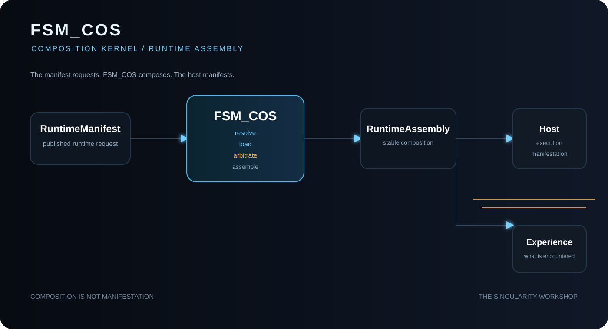

# ✳️ 00 The Singularity Workshop — FSM_COS

[](https://opensource.org/licenses/MIT)
[](https://www.nuget.org/packages/TheSingularityWorkshop.FSM_COS)
[](https://www.nuget.org/packages/TheSingularityWorkshop.FSM_COS)
[](https://github.com/TrentBest/TheSingularityWorkshop.FSM_COS/actions/workflows/package.yml)
[](https://codecov.io/gh/TrentBest/TheSingularityWorkshop.FSM_COS)

<p align="center">
  
</p>

FSM_COS is The Singularity Workshop's **runtime composition kernel**. It takes a request for capabilities, resolves the MicroBundles and dependencies needed to satisfy it, and hands the assembled result to a host.

## 🟦 01 — What is FSM_COS?

Think of a runtime manifest as an order: it says which capabilities are wanted. FSM_COS works out what else must be present for that order to make sense, loads the composition, and gives its bundles a bounded chance to reconcile their composition state. It hands the result to the host only if that arbitration process reports convergence.

The result is a `RuntimeAssembly`—a handoff to another system, not a finished application.

**In one line:** the manifest says what is requested; FSM_COS assembles what must exist together; the host decides what happens next.

## 🟣 02 — Why does it exist?

Without a distinct composition layer, each host can end up owning its own dependency logic and capability wiring. That makes reusable behavior harder to share and encourages application-specific concerns to leak into lower-level libraries.

FSM_COS gives that work a focused home. A browser app, desktop program, service, simulation, or headless tool can supply its own catalog and decide how to use the resulting assembly. The kernel does not require a particular interface or application type.

This is an architectural boundary, not a promise that every capability is automatically portable. Compatibility still depends on the contracts, dependencies, and abilities of the host.

## 🩵 03 — How does it work?

```text
Runtime Manifest
      │ requested MicroBundles and versions
      ▼
   FSM_COS
      ├── resolve requested bundles
      ├── discover dependencies
      ├── apply available configuration
      ├── load the composition
      └── arbitrate toward convergence
      ▼
RuntimeAssembly
      │ handoff
      ▼
Host / application / experience
```

Each part has a clear owner:

- **MicroBundleDomain** defines the MicroBundle contract.
- **The host or repository** supplies a catalog that can find the requested bundles.
- **FSM_COS** resolves dependencies, loads the composition, and runs bounded arbitration.
- **The host** owns application lifecycle, execution, user interface, and presentation.

FSM_COS is not a GUI, engine, artifact repository, transport layer, or application loop. For the exact contracts and responsibility boundaries, see [Architecture](docs/ARCHITECTURE.md) and [Runtime Boundary](docs/RUNTIME_BOUNDARY.md).

## 🟢 04 — See it in a minute

The repository includes a tiny runnable consumer that demonstrates the package's actual purpose: assembling a requested bundle and its dependency. You need Git and the **.NET 8 SDK**.

```bash
git clone https://github.com/TrentBest/TheSingularityWorkshop.FSM_COS.git
cd TheSingularityWorkshop.FSM_COS
dotnet run --project samples/FSM_COS.MinimalConsumer/FSM_COS.MinimalConsumer.csproj
```

**What should happen?** The sample loads bundle `2` (the data-source prerequisite) before bundle `1` (the report), then prints `Assembly order: 2 -> 1`. The sample defines its own in-memory catalog and two tiny MicroBundles; those are example code, not extra types supplied by FSM_COS.

This is a source-repository example and references the local FSM_COS project so it can be verified before a release is published. For the exact published package status, check the [NuGet package page](https://www.nuget.org/packages/TheSingularityWorkshop.FSM_COS). To build your own host, start with [Consuming MicroBundles](docs/CONSUMING_MICROBUNDLES.md), which explains the catalog, manifest, configuration, and bundle contracts.

The source targets **.NET 8** and currently declares version `0.1.0-alpha.6`; a source version declaration alone does not establish publication status.
  
## 🟪 05 — Available documentation and theory

Pick the question you want answered; each document focuses on one topic.

- **New to software or this architecture?** [What Is FSM_COS?](docs/WHAT_IS_FSM_COS.md) introduces the problem and key terms without assuming programming experience. [FSM_COS Theory](docs/THEORY.md) develops the deeper rationale.
- **Need the system map?** [Architecture](docs/ARCHITECTURE.md) explains component ownership and runtime flow.
- **Building a consumer?** [Consuming MicroBundles](docs/CONSUMING_MICROBUNDLES.md) shows how to provide a catalog and bundles.
- **Defining a request?** [Runtime Manifest](docs/RUNTIME_MANIFEST.md) explains requested bundle identities and versions; [Manifest Theory](docs/MANIFEST_THEORY.md) explains the design rationale.
- **Receiving the result?** [RuntimeAssembly](docs/RUNTIME_ASSEMBLY.md) describes the handoff object.
- **Need the exact stopping point?** [Runtime Boundary](docs/RUNTIME_BOUNDARY.md) explains what FSM_COS owns and what remains with the host.
- **Wondering how stability is reached?** [Arbitration](docs/ARBITRATION.md) covers reconciliation and convergence.
- **Integrating a host?** [WebPage Integration](docs/WEBPAGE_INTEGRATION.md) documents one browser-host integration without moving browser concerns into the kernel.
- **Checking how Workshop packages fit together?** [Ecosystem Integration Map](https://github.com/TrentBest/TheSingularityWorkshop.FSM_COS/blob/master/docs/ECOSYSTEM_INTEGRATION_MAP.md) is a source-repository working snapshot; verify its point-in-time source facts before relying on them.
- **Checking alpha.6 scope and limitations?** [Release notes](docs/releases/0.1.0-alpha.6.md) describe the source candidate's contracts and explicit non-goals.
- **Building or contributing?** [Development](docs/DEVELOPMENT.md) covers repository setup, tests, and workflows.
- **Looking for another topic?** Open the [Documentation Index](DOCUMENTATION_INDEX.md).

---

<p align="center">
  <a href="https://github.com/TrentBest">
    
  </a>
</p>

<p align="center">
  <a href="https://github.com/TrentBest">GitHub</a> ·
  <a href="https://coderlegion.com/">Coder Legion</a> ·
  <a href="https://www.patreon.com/c/TheSingularityWorkshop">Patreon</a> ·
  <a href="https://www.paypal.com/donate/?hosted_button_id=3Z7263LCQMV9J">PayPal</a>
  <br>
  <a href="https://github.com/TrentBest/FSM_API">FSM_API</a> ·
  <a href="https://github.com/TrentBest/TheSingularityWorkshop.FSM_Serialization">FSM_Serialization</a> ·
  <a href="https://github.com/TrentBest/WebPage">WebPage</a>
</p>

<p align="center"><em>The Singularity Workshop — Tools for the curious, the bold, and the systemically inclined.</em><br><strong>Because state shouldn't be a mess.</strong><br><em>And because static boundaries are invitations to cause trouble.</em></p>
