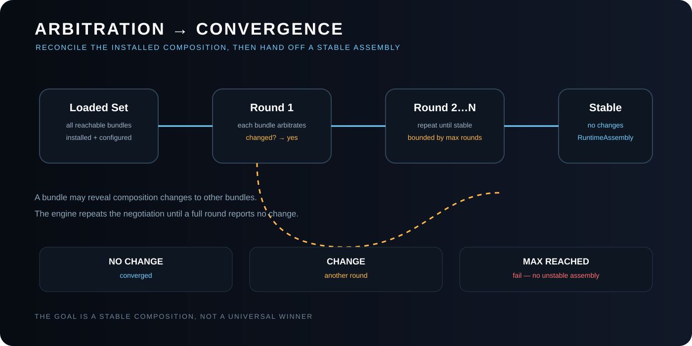

# Arbitration and Convergence

> **Arbitration is where interoperability stops being a slogan and becomes a runtime property.**

See [FSM_COS Theory](THEORY.md#8-arbitration-is-composition-negotiation) for the compact model. This document is the deeper treatment.

## The question arbitration actually answers

Dependency resolution asks:

> **What must exist?**

Arbitration asks:

> **Now that those things exist together, can the composition settle into a state in which their contracts remain satisfiable?**

That distinction is why FSM_COS is a composition system rather than a sophisticated loader.

A loader can establish an inventory. It cannot, by itself, establish that independently authored capabilities can coexist coherently once installed.

Arbitration creates a bounded reconciliation phase between **installation** and **handoff**.

~~~text
Runtime Manifest
      ↓
dependency closure
      ↓
configured installation
      ↓
ARBITRATION
      ↓
convergence
      ↓
RuntimeAssembly
~~~

The result is not a winner. The result is a **stable relationship between participants**.

---

## Why interoperability is normally difficult

Interoperability is often reduced to questions such as:

- Can component A call component B?
- Can they deserialize the same message?
- Do they share an interface?
- Can they load into the same process?

Those questions matter, but they describe mostly **pairwise compatibility**.

Real compositions are contextual.

~~~text
GUI          expects a presentation surface
Physics      expects spatial state
Navigation   expects traversable space
Identity     expects a visitor anchor
Telemetry    expects observable transitions
~~~

None of those capabilities necessarily owns the others.

Traditional application architecture often solves this by creating a larger owner:

~~~text
              MASTER APPLICATION
              /       |                  GUI     Physics   Navigation
~~~

That master becomes the place where every conflict is understood, every ordering rule is encoded, and every new capability eventually acquires another special case.

FSM_COS deliberately avoids making the composition kernel that master.

Arbitration provides another model:

~~~text
          GUI ─────────────┐
                           │
       Physics ────────────┼──► shared composition
                           │
      Navigation ──────────┤
                           │
       Identity ───────────┘
~~~

Each participant can respond to the composition it finds without requiring one universal application owner to understand every domain.

---

## Arbitration changes the interoperability concern

Without arbitration, interoperability tends to mean:

> **Can these modules be connected?**

With arbitration, interoperability can mean:

> **Can these modules participate in a shared composition and converge without requiring one module to become the universal owner?**

That is the architectural leap.

A may be compatible with B in isolation and compatible with C in isolation, while A+B+C creates a condition none of the pairwise interfaces can express.

Arbitration gives the assembled system a place to discover and reconcile that condition.

This is not merely a second initialization pass. It is the phase in which the composition answers whether it can **live together**.

---

## Arbitration is not priority arbitration

The name can suggest a judge selecting a winner. That is not the model.

FSM_COS does not define a universal hierarchy such as:

~~~text
highest priority wins
lowest priority loses
~~~

Instead:

~~~text
participant A changes something
        ↓
participant B observes the composition
        ↓
B may change something
        ↓
participant C observes the new composition
        ↓
repeat until a full round changes nothing
~~~

The composition itself is the shared object of negotiation.

A navigation bundle can establish that a route is impossible. A GUI bundle can establish that a surface must exist. A physics bundle can establish that a spatial constraint must hold. None of those facts automatically makes one bundle sovereign over the others.

Arbitration lets capabilities express consequences instead of demanding ownership.

---

## The convergence law

The alpha contract is deliberately small:

1. every reachable bundle is installed;
2. every installed bundle participates in a round;
3. a participant returns true when its participation changed the composition;
4. it returns false when it did not;
5. a complete round with no changes means convergence;
6. the engine stops at the configured maximum number of rounds;
7. failure to converge is an error.

~~~text
round 1 → changed
round 2 → changed
round 3 → unchanged
              ↓
          CONVERGED
~~~

The current ten-round bound is a safety boundary, not a universal constant.

The deeper invariant is:

> **No unstable composition crosses the RuntimeAssembly boundary as if it were stable.**

---

## Why bounded convergence matters

An open-ended negotiation loop could permit pathological participants:

~~~text
A changes B
B changes A
A changes B
B changes A
...
~~~

Without a bound, the runtime has no principled stopping point.

With a bound:

~~~text
round 1
round 2
...
round N
  ├── stable → success
  └── unstable → failure
~~~

The host therefore gets a meaningful contract:

- RuntimeAssembly means the composition reached its stable point;
- failure means the requested composition could not establish that point.

The host does not need to invent its own interpretation of “probably stable enough.”

---

## The strongest participants are boring

A good arbitrator is not an application loop hidden inside a MicroBundle.

A good arbitrator is:

- deterministic;
- local in responsibility;
- explicit about what it changed;
- safe to run again;
- respectful of the shared composition;
- independent of the final host where possible.

The ideal shape is effectively:

~~~text
apply requirement
    ↓
already satisfied?
    ├── yes → no change
    └── no  → satisfy it → changed
~~~

That makes convergence legible and testing meaningful.

A second pass over an already-satisfied condition should not manufacture another change simply to keep the system busy.

---

## Structural composition versus behavioral reconciliation

Dependencies are usually represented as a graph:

~~~text
Experience
 ├── Navigation
 │    └── SpatialModel
 ├── GUI
 │    └── PresentationModel
 └── Identity
      └── VisitorModel
~~~

The graph establishes **what is installed**.

But Navigation may reveal a spatial interaction point. SpatialModel may expose a constraint that changes presentation. The GUI may reveal that an interaction requires an identity affordance. Identity may then change available presentation state.

The dependency graph establishes structural composition.

Arbitration establishes **behavioral reconciliation**.

That distinction is fundamental.

---

## Arbitration creates an interoperability seam

A traditional integration boundary often looks like:

~~~text
Provider API → Consumer API
~~~

FSM_COS adds a third space:

~~~text
Provider
    ↓
shared composition
    ↑
Consumer
~~~

Neither participant has to own the entire application. Both can contribute facts or constraints to the shared composition.

That creates a **negotiation seam**.

This seam becomes particularly valuable when capabilities come from different authors, packages, domains, or future versions of the ecosystem. The composition kernel provides a stable place for them to reconcile without forcing their internal implementations to know about one another.

That is why arbitration can become a major interoperability primitive rather than a minor lifecycle callback.

---

## What arbitration must not become

Arbitration must not become a back door for application infrastructure.

A MicroBundle should not use arbitration to:

- render UI;
- open a browser;
- start arbitrary background processes;
- mutate unrelated host state;
- perform network orchestration;
- become an application scheduler;
- encode every business rule in the composition kernel;
- secretly implement serialization;
- establish an undocumented universal priority hierarchy.

If a concern can be handled after RuntimeAssembly, it belongs after RuntimeAssembly.

The boundary is valuable precisely because not everything is allowed to cross it.

---

## Arbitration versus serialization

Serialization answers:

> **How do I represent semantic state as bytes?**

Arbitration answers:

> **Given these semantic participants, have we reached a stable composition?**

Those concerns can touch the same configuration data without being the same problem.

~~~text
FSM_Serialization
      ↓ representation
MicroBundleDependencyRequest
      ↓
FSM_COS
      ↓ composition
Arbitration
      ↓
RuntimeAssembly
~~~

Keeping these boundaries separate means a serialization format can evolve without changing convergence semantics.

See [FSM_Serialization Theory](https://github.com/TrentBest/TheSingularityWorkshop.FSM_Serialization/blob/master/docs/THEORY.md).

---

## The interoperability thesis

The thesis is:

> **Interoperability is not only the ability to exchange data or invoke APIs. In a compositional runtime, interoperability is the ability of independently defined capabilities to participate in a shared state space and converge without requiring one of them to become the universal owner.**

FSM_COS does not claim that arbitration solves every interoperability problem.

It creates a place where one important class of problem can be addressed:

**composition-level compatibility.**

That is a meaningful architectural boundary.

---

## The contract at the edge

At the end of arbitration, the kernel should be able to say one of two things:

~~~text
SUCCESS
The requested composition converged.
RuntimeAssembly is valid for handoff.
~~~

or:

~~~text
FAILURE
The requested composition did not converge within the safety bound.
No stable RuntimeAssembly is produced.
~~~

That is stronger than “all DLLs loaded.”

It is stronger than “all constructors succeeded.”

It is stronger than “the host can probably figure it out.”

It gives the composition boundary an actual semantic completion condition.

---

## The short version

~~~text
LOAD
  ↓
What exists?
  ↓
ARBITRATE
  ↓
Can what exists live together?
  ↓
CONVERGE
  ↓
Is the composition stable?
  ↓
ASSEMBLE
  ↓
HAND OFF
~~~

> **Arbitration is not a fight for control. It is the mechanism by which independent capabilities discover whether they can become one stable system.**

---

## 🔗 The Singularity Workshop

FSM_COS is one layer in a deliberately troublesome ecosystem:

- **[FSM_API](https://github.com/TrentBest/FSM_API)** — behavior and state.
- **[FSM_COS](https://github.com/TrentBest/TheSingularityWorkshop.FSM_COS)** — composition and runtime assembly.
- **[FSM_Serialization](https://github.com/TrentBest/TheSingularityWorkshop.FSM_Serialization)** — representation and the byte boundary.
- **[WebPage](https://github.com/TrentBest/WebPage)** — browser manifestation and proving ground.
- **[FSM_API_Unity](https://github.com/TrentBest/FSM_API_Unity)** — Unity manifestation.

<em>The Singularity Workshop — Tools for the curious, the bold, and the systemically inclined.</em> <strong>Because state shouldn't be a mess.</strong> <em>And because static boundaries are invitations to cause trouble.</em>

