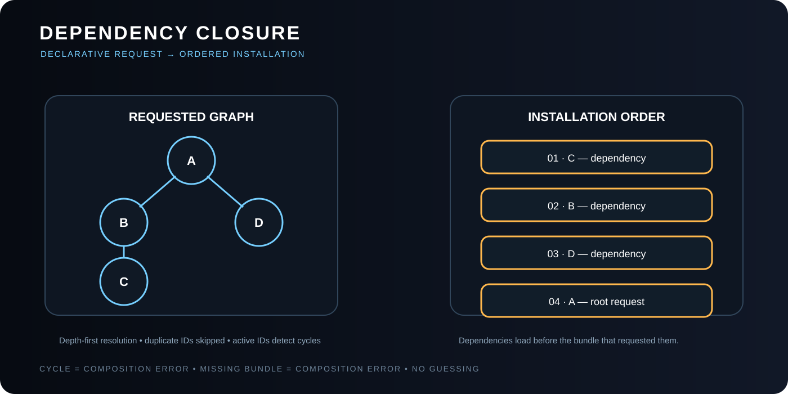

# FSM_COS Architecture

> **Architecture answers how the composition kernel performs the theory.** For the deeper “why,” start with [FSM_COS Theory](THEORY.md).

FSM_COS is a small composition kernel. This document describes how its pieces cooperate rather than redefining concepts owned by neighboring systems.

## Runtime flow


    RuntimeManifest
          │
          ▼
       FsmCos.Execute
          │
          ├── resolve requested bundle
          ├── recursively resolve dependencies
          ├── pass configuration
          ├── Load()
          ├── Arbitrate() until stable
          ▼
    RuntimeAssembly

## Core contracts

### RuntimeManifest
Identifies the runtime being assembled and supplies root MicroBundle manifest entries. It is composition input, not application behavior. See [Runtime Manifest](RUNTIME_MANIFEST.md) and [Runtime Manifest Theory](MANIFEST_THEORY.md).

### MicroBundle manifest entries
A manifest entry identifies a requested MicroBundle and its requested version. Configuration is intentionally not part of the manifest. A separate configuration source may provide per-MicroBundle configuration at runtime.

### IMicroBundleCatalog
Resolves a bundle identity to the IMicroBundle required for installation. The catalog is supplied by the host, so future Warehouse-backed or generated resolvers do not require a different composition algorithm.

### IMicroBundle
Consumes the domain-owned `MicroBundleDescriptor` for identity/version/providers, while retaining composition-specific dependency configuration, Load, and Arbitrate behavior. FSM_COS does not redefine MicroBundle domain metadata. It does not expose a GUI, web server, or host lifecycle contract.

### MicroBundleLoadContext
Carries runtime identity and configuration available during installation. Configuration remains opaque to FSM_COS.

### ArbitrationContext
Exposes runtime identity, the currently loaded bundle set, and an optional FSM_API `IStateContext` supplied by the host. It is composition context, not host lifecycle state.

### RuntimeAssembly
The result surface of the composition pass: runtime identity, loaded bundles, and arbitration count. See [RuntimeAssembly](RUNTIME_ASSEMBLY.md) and [FSM_COS Theory — RuntimeAssembly is the handoff object](THEORY.md#9-runtimeassembly-is-the-handoff-object).



The conceptual reason for deriving this order rather than encoding it in the manifest is explained in [FSM_COS Theory — Composition starts with roots, not a giant object graph](THEORY.md#4-composition-starts-with-roots-not-a-giant-object-graph).

## Dependency resolution

FSM_COS performs depth-first dependency resolution.

    requested A
       │
       ├── B
       │   └── C
       └── D

The resulting installation order is C, B, D, A.

Two guards are fundamental: already-loaded IDs are skipped, and IDs currently loading are tracked to detect cycles.

Missing bundles and dependency cycles are composition failures.

## Configuration propagation

Configuration is an external runtime input. FSM_COS accepts configuration through an abstraction supplied by the host/repository layer; it does not read configuration files or interpret their format. If no configuration is available for a bundle, the bundle is loaded without external configuration and uses its defaults.

## Arbitration

After reachable bundles are loaded, FSM_COS creates one ArbitrationContext.

    for each round
        for each loaded bundle
            changed |= bundle.Arbitrate(context, round)
        if no change → converged

If the configured maximum is reached without convergence, FSM_COS throws instead of returning an unstable assembly. The current default is ten rounds.

## Catalog boundary

The catalog stays outside the composition algorithm:

    FSM_COS ← Catalog ← in-memory / generated registry / Warehouse / cache / Domain resolver

The composition engine should not need to know where a bundle came from.

## Host boundary

    FSM_COS
       │
       ▼
RuntimeAssembly
       │
       ├── WebPage → browser experience
       ├── AnyApp → desktop/local experience
       └── other hosts → their own manifestation

## Current development boundary

The active development line is refining the manifest/configuration boundary while preserving the small composition kernel:

```text
Manifest (bundle + version)
        ↓
resolver / catalog
        ↓
configuration source (optional)
        ↓
dependency closure
        ↓
Load()
        ↓
Arbitrate() until stable
        ↓
RuntimeAssembly
```

File I/O, repository transport, serialization, host lifecycle, and presentation remain outside the kernel.

Execution scheduling, resource allocation, Warehouse integration, and host lifecycle belong to later layers when their contracts are sufficiently clear.

---

## 🔗 The Singularity Workshop

FSM_COS is one layer in a deliberately troublesome ecosystem:

- **[FSM_API](https://github.com/TrentBest/FSM_API)** — behavior and state.
- **[FSM_COS](https://github.com/TrentBest/TheSingularityWorkshop.FSM_COS)** — composition and runtime assembly.
- **[FSM_Serialization](https://github.com/TrentBest/TheSingularityWorkshop.FSM_Serialization)** — representation and the byte boundary.
- **[WebPage](https://github.com/TrentBest/WebPage)** — browser manifestation and proving ground.
- **[FSM_API_Unity](https://github.com/TrentBest/FSM_API_Unity)** — Unity manifestation.

<p align="center"><em>The Singularity Workshop — Tools for the curious, the bold, and the systemically inclined.</em><br><strong>Because state shouldn't be a mess.</strong><br><em>And because static boundaries are invitations to cause trouble.</em></p>
