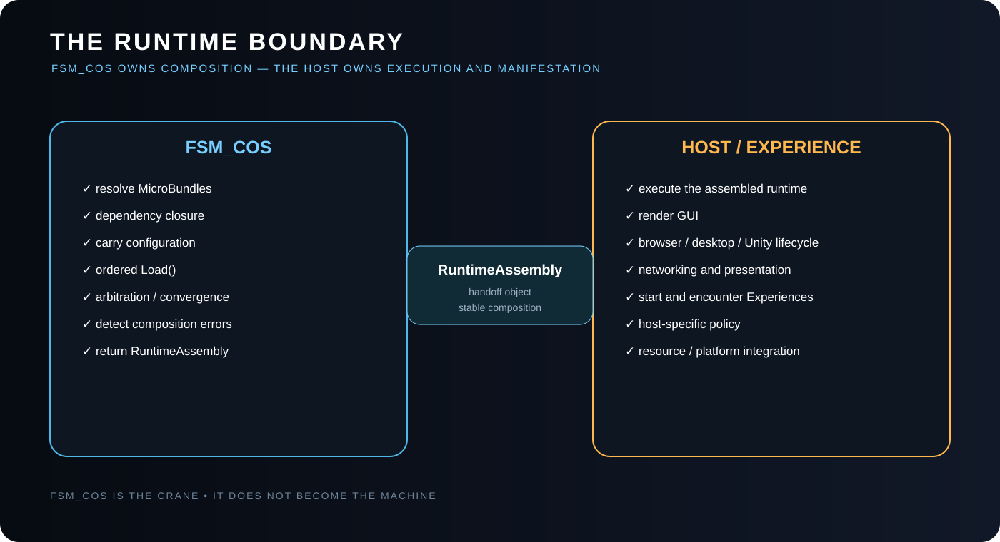
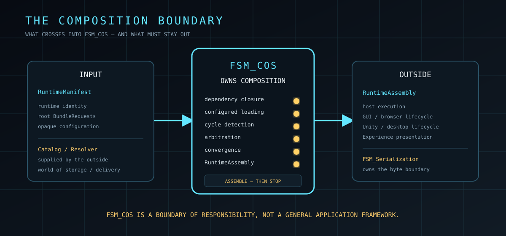

# FSM_COS Runtime Boundary

> The boundary is easier to understand once the theory is clear: [FSM_COS Theory](THEORY.md) defines why composition stops where it does.

## Purpose

FSM_COS exists to assemble a requested computation. It is not the application or runtime host.

The boundary is:

~~~text
published request
      ↓
   FSM_COS
      ↓
RuntimeAssembly
      ↓
host / Experience execution
~~~

## FSM_COS owns

FSM_COS owns the common computation-composition operations required to turn a RuntimeManifest into a stable RuntimeAssembly:

1. resolve requested MicroBundles;
2. resolve dependency closure;
3. accept optional external configuration through the configuration-source boundary;
4. install/load dependencies before dependents;
5. arbitrate over the installed composition;
6. detect cycles, missing bundles, and non-convergence;
7. return the assembled result.

## FSM_COS does not own

The following remain outside the kernel:

- starting an Experience;
- stepping FSM_API process groups;
- rendering GUI nodes;
- browser or desktop lifecycle;
- Unity scene/object lifecycle;
- Warehouse storage and allocation;
- networking;
- domain rules;
- presentation effects;
- telemetry and metaDev learning;
- user interaction policy.

A host may use the RuntimeAssembly to perform those operations, but those operations are not silently pulled into FSM_COS.

## Unity boundary

A Unity-facing implementation may consume FSM_COS, but Unity-specific code belongs outside this repository's composition kernel.

The same rule applies to WebForge/Blazor:

~~~text
FSM_COS
   ↓
RuntimeAssembly
   ↓
platform adapter / host
   ↓
Unity / browser / desktop / other manifestation
~~~

This prevents the composition package from acquiring platform lifecycle dependencies.

## Configuration boundary

Configuration is supplied independently of the Runtime Manifest. FSM_COS does not read configuration files or interpret their format; it consumes the optional configuration source contract and passes available configuration into the composition lifecycle. When no configuration exists, the MicroBundle uses its defaults.

## Serialization boundary

Serialization is adjacent to composition, but it is not composition.

When a manifest or bundle configuration becomes bytes, the reusable byte-oriented infrastructure belongs to **[TheSingularityWorkshop.FSM_Serialization](https://github.com/TrentBest/TheSingularityWorkshop.FSM_Serialization)**. FSM_COS should consume the resulting semantic/runtime representation rather than absorb the serialization package's responsibility.

See [FSM_COS Theory — Composition is not serialization](THEORY.md#14-composition-is-not-serialization) and [FSM_Serialization Theory](https://github.com/TrentBest/TheSingularityWorkshop.FSM_Serialization/blob/master/docs/THEORY.md).

## Warehouse boundary

A Warehouse may eventually provide the catalog or resolver used by FSM_COS.

That relationship is:

~~~text
RuntimeManifest
      ↓
    FSM_COS
      ↓
 catalog / resolver
      ↓
 Warehouse
~~~

The Warehouse remains responsible for storage and delivery. FSM_COS remains responsible for composition.

## Experience boundary

An Experience may be represented by a set of MicroBundles and therefore be assembled by FSM_COS.

Assembly does not execute the Experience.

That distinction is essential for cases such as a semantic preview: a composition can be loaded and inspected without accidentally starting its presentation Experience.

## The invariant

> **FSM_COS assembles. The host executes and manifests.**

---

## 🔗 The Singularity Workshop

FSM_COS is one layer in a deliberately troublesome ecosystem:

- **[FSM_API](https://github.com/TrentBest/FSM_API)** — behavior and state.
- **[FSM_COS](https://github.com/TrentBest/TheSingularityWorkshop.FSM_COS)** — composition and runtime assembly.
- **[FSM_Serialization](https://github.com/TrentBest/TheSingularityWorkshop.FSM_Serialization)** — representation and the byte boundary.
- **[WebPage](https://github.com/TrentBest/WebPage)** — browser manifestation and proving ground.
- **[FSM_API_Unity](https://github.com/TrentBest/FSM_API_Unity)** — Unity manifestation.

<em>The Singularity Workshop — Tools for the curious, the bold, and the systemically inclined.</em> <strong>Because state shouldn't be a mess.</strong> <em>And because static boundaries are invitations to cause trouble.</em>

